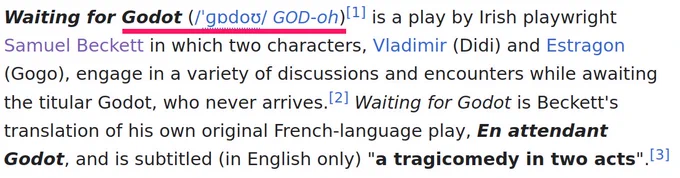
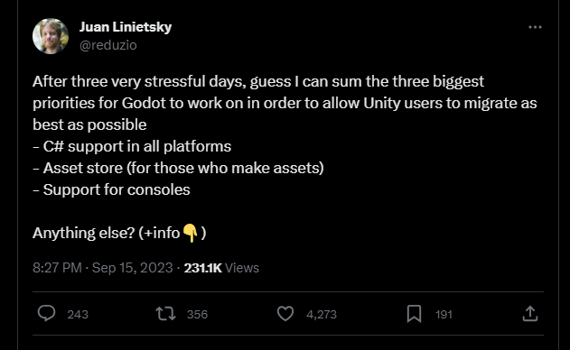

# 一. Godot 4.x 概念快速入门

作者：忘忧の（Daylily-Zeleen）
email: <daylily-zeleen@foxmail.com>
Bilibili: <https://space.bilibili.com/6943295>
Github: <https://github.com/Daylily-Zeleen>
爱发电: <https://afdian.net/@Daylily-Zeleen>

注意时效性，目前是4.1.1 stable

## 1.概述

- Godot怎么读？
- 面向有基本编程素养/想拥有最基础编程素养的用户。
- 时间就是金钱，本课程目标是以最简短时间帮助用户了解Godot的基础概念和开发思想。

## 2.一些Godot作品展示

- Showcases: <https://godotengine.org/showcase/>
- 索尼克 缤纷色彩 究极版: <https://www.bilibili.com/video/BV1NP411h7Ny/?spm_id_from=333.337.search-card.all.click&vd_source=a812248502c29af3e3c242f755f3e3fe>
- 链接消消乐: <https://www.taptap.cn/app/235525>

## 3.献给Unity难民

### 3.1 什么情况你的逃难的首选地不该是Godot(或者说Godot的不足)

- 微信小程序: 没有一键点击的成熟方案
- 所谓的“超写实3D”: Godot的渲染性能较弱，GI阴影边缘的细小点状目前还没解决，追求严苛的写实效果建议直接UE
- 有超级繁重的3D物理需求: 自带的物理引擎真的拉跨，可以用第三方插件，但是目前不支持所有物理特性。
- 无法容忍任何Bug/不足：开源社区，一切都是用爱发电，发现问题报issue，有能力就帮忙修。
- *有主机/游戏机平台需求*: 不是做不到，而是Mit开源项目就不可能包含人家主机厂商的开发套件。
  
### 3.2 吃一颗定心丸

- 2D除去bug之外天下第一
- 3D画质：
  - 借用小伙伴调教的[画面测试](https://www.bilibili.com/video/BV13z4y1L7Mi/?spm_id_from=333.337.search-card.all.click&vd_source=a812248502c29af3e3c242f755f3e3fe)
  - 油管[转载](https://www.bilibili.com/video/BV1Dv4y1G7HM/?spm_id_from=333.337.search-card.all.click&vd_source=a812248502c29af3e3c242f755f3e3fe)
- 主机/游戏机平台： [W4Games](https://w4games.com/)
- 关于3D物理：能用，但是性能确实稀烂。但是有望将开源物理引擎Jolt集成到Godot中，目前也可以通过插件形式将Jolt加入到引擎中。**(Waiting)**
- 关于C#：现在还不支持web和ios **(Waiting)**，也没有合适的热更方案。
  

### 3.3 GDScript是什么？我到底该不该学？

C#在Godot中的定位也并非所谓的二等公民，而是仍在发展中。

如果你能接受在Godot中使用C#的局限性(**注意时效现在是2023.9.17，以后可能会得到解决，但我不一定会更新该文档**)，完全没必要学GDSript。
否则，我只能强烈推荐你学习GDScript。

### 3.4 Unity基本概念如何与Godot对应起来？

|Unity|Godot|
|:-:|:-:|
|*--GamePlay--*|
|Component|Node|
|GameObject|Node|
|Prefab|PackedScene|
|*--Editor--*|
|Hierarchy Panel|Scene |
|Inspector|Inspector|
|Project Browser|File System|
|Scene View|2D/3D|

本人并不熟悉Unity，如果还有其他需要补充，欢迎评论区讨论。

### 3.5 Dots(ECS)能不能挪到Godot里来？

不能。一般情况下使用场景与节点的OOP思想来实现你的游戏完全够用，但是节点数量多时也免不了性能问题，这时可以考虑使用各种Server来进行优化（根据你的实现方式，可以获得ECS对Component处理上内存连续带来的性能优势，也避免使用Node繁重又使用不上的功能）。

## 4.Godot开发语言之争

GDScript？C#？C++？其他语言？

### 4.1 **GDScript**（简称GDS）

Godot的亲儿子，你可以永远相信[GDScript](https://docs.godotengine.org/en/stable/tutorials/scripting/gdscript/index.html)不会被Godot抛弃（点名批评UnityScript）。
至于Godot[为什么要自己弄一个GDScript](https://docs.godotengine.org/en/stable/about/faq.html#what-is-gdscript-and-why-should-i-use-it),这种问题真的没必要问了。

优点：

- 集成度高
- 语法简单，类似python
- 直接使唤，不需要配置任何开发环境，简单方便
- 可选类型真的很棒好吗？什么脚本不能开发大项目都是谣言，存粹是管理不当。
- 脚本语言，热更无压力。

缺点：

- 生态是什么？不存在的，离开了Godot什么都不是。

### 4.2 **C#**

在Godot中使用C#的[文档](https://docs.godotengine.org/en/stable/tutorials/scripting/c_sharp/index.html)。

优点：

- 库多
- 生态好
- 不依赖引擎

缺点：

- 目前没有热更方案，HybridCLR也把对Godot支持从未来计划中移除了┑(￣Д ￣)┍
- 暂不支持web和ios，不过Juan他们已经在Unity自爆之后立刻把C#全平台支持提上日程了。

**注意信息时效性：现在事2023.9.17，以后这些缺点解决了我也不一定会更新这个文档。**

### 4.3 C++

- 引擎开发：Godot的源码Mit开源，所以你直接写C++改造引擎，或者为Godot添加功能(通过[Module](https://docs.godotengine.org/en/stable/contributing/development/core_and_modules/custom_modules_in_cpp.html)实现)完全是没问题的。
- 插件开发: 和源码一起编译费时对吧？只想编译自己的功能就行对吧？想即插即用对吧？欢迎使用[GDExtension](https://github.com/godotengine/godot-cpp)(请注意，GDE仍然处于开发阶段)。

本教程是入门教程，c++相关的开发咱就不多讲了，反正[链接在这里](https://docs.godotengine.org/en/stable/tutorials/scripting/gdextension/index.html)。
如果大家需求比较大的话，以后有时间也许会出个Godot的C++开发教程。

### 4.4 其他语言

有许多第三方支持的语言

- Lua **Godot Lua API**: <https://github.com/WeaselGames/godot_luaAPI>
- Rust **gdext**: <https://github.com/godot-rust/gdext>
- Luau **GDLuau**: <https://github.com/Manonox/GDLuau>

### 4.5 **GDScript** / **C#**？

||GDScript|C#|
|:-|:-:|:-:
|集成度|✔|
|生态||✔
|通用性||✔
|Godot的逻辑热更|✔|
|语言本身的性能（或者说纯算法）||✔
|与引擎API交互|**部分情况下更快**|
|上手便利性|✔|
|游戏逻辑开发便利性|✔|
|编辑器插件开发便利性|✔|
|外接SDK||✔|

性能问题不要过于纠结，正常使用一般也摸不到语言上限，真碰到瓶颈也不是说GDS换C#能解决的，不如修改算法或者尝试换c++实现。
估计有很多东西还没想到，也没太必要纠结。

这两者不是对立关系，用合适的语言做合适的事，并不冲突，两者可以[相互调用](https://docs.godotengine.org/en/stable/tutorials/scripting/cross_language_scripting.html)，后续教程应该会讲到。

这个入门教程我会同时使用C#和GDS，无论你是纯新手只想学GDS当脚本小子，还是Unity难民想快速入门。

### 4.6 总结

实际上要用什么语言不是你说了算，而是有什么用什么，需求要求用什么就用什么，希望看完这一节之后大家不要再陷入无意义的语言之争，语言永远只是工具。

如果你想学Godot里的C#，**请务必非常详细地阅读**文档中关于C#与GDScript的差异。
如果你碰上的教程是Gds也不要紧，大体上只是 snake_case 换 PascalCase,而已。

## 5.Godot Engine 的下载/安装/开发环境配置，初识编辑器

- Godot官网: <https://godotengine.org/>
- 自包含模式：`_sc_`

纯GDS用户齐活了。

- 康康编辑器？
  - 文件系统(`res://`, `user://`)
  - 场景树
  - 检查器
  - 主编辑面板：2D, 3D, 脚本编辑器， 资产库
  - 下方多功能的面板(重点是"输出"与"调试")
  - 其他零碎按钮与下拉菜单，设置
  - **F1帮助文档**

- C#开发环境配置：<https://docs.godotengine.org/en/stable/tutorials/scripting/c_sharp/c_sharp_basics.html>
  
  - 下载安装 .net6.0 以上
  - 配置外部编辑器（VSCode/Rider）

## 6.关键概念

### 6.1 面向对象（OOP）

[百度](https://baike.baidu.com/item/%E9%9D%A2%E5%90%91%E5%AF%B9%E8%B1%A1%E7%A8%8B%E5%BA%8F%E8%AE%BE%E8%AE%A1/24792?fr=ge_ala)

- (封装与)继承与多态
- 类与实例

### 6.2 场景、节点、场景树

(<https://docs.godotengine.org/en/stable/getting_started/introduction/key_concepts_overview.html>

  1. 场景 Scenes: 由节点组织而成
  2. 节点 Nodes: 组成场景的基本功能元素
  3. 场景树 Scene Tree: 运行时所有场景/节点都在同一颗场景树中

### 6.3 信号 Signals

<https://docs.godotengine.org/en/stable/getting_started/introduction/key_concepts_overview.html#signals>

[观察者模式/发布-订阅模式](https://baike.baidu.com/item/%E8%A7%82%E5%AF%9F%E8%80%85%E6%A8%A1%E5%BC%8F/5881786?fr=ge_ala)

  1. 订阅者的`回调` --`连接/订阅`-> 发布者的`信号/事件`
  2. 发布者广播`信号/事件`，即对通知所有订阅者执行`回调`

### 6.3 Object/Node/RefCounted与内存管理

#### 6.3.1 Object

`Object`是Godot中所有对象的基类，包含一个对象具有的最基础功能，如信号等
**注意：Godot没有垃圾回收(GC)机制,记得在不需要的时候使用`free()`将其释放。**

`Node`和`RefCounted`都直接继承自`Object`

#### 6.3.2 Node

`Node`是组成场景的基本元素，场景的组织与功能非常灵活多变，因此也要求`Node`具有更多的功能:

- 场景组织
- 节点生命周期
- rpc
- ......

可以说相比`Object`,`Node`的功能繁重得多，但这也是值得。

**需要注意的是：`Node`的释放需要使用`queue_free()`，而且`Node`的释放不只会释放自己，还会释放自己的子节点**

#### 6.3.3 RefCounted

正如其名，`RefCounted`在`Object`的基础上增加了引用计数的功能帮我们简化内存管理的问题。当它这个对象不再被引用时将被自动释放。

**注意：避免循环引用！！两个互相引用的对象将无法被自动释放。**->`weakref()`

**C#用户要注意**,`RefCounted`在C#中的行为与GDS不同，如果不进行特殊操作，C#会自动持有1个RefCounted的引用，导致在你的逻辑中不再被使用也不会自动释放。
如果你想让`RefCounted`具有和GDS相同的行为，请使用：

```C#
  using(refCounted)
  {
    // Do something.
  }
```

#### 6.3.4 总结

- 完全没有必要使用`Object`作为基类来扩展功能。
- 如果你想在场景树中组织你的功能，使用`Node`。
- 其他任何场合你就放心使用`RefCounted`吧。

### 6.4 路径

- 资源路径:`res://`
- 用户路径:`user://`

### 6.5 资源 Resource

<https://docs.godotengine.org/en/stable/tutorials/scripting/resources.html>

### 6.6 自动加载 Autoload

 <https://docs.godotengine.org/en/stable/tutorials/scripting/singletons_autoload.html>
 类似单例模式，但不保证唯一性。拥有全局类名、在游戏开始时被实例化并添加到场景树的节点

### 6.7 Godot的Variant与基本类型

- Variant
<https://docs.godotengine.org/en/stable/contributing/development/core_and_modules/variant_class.html>
简而言之就是可以容纳几乎所有类型。

- 基本类型
<https://docs.godotengine.org/en/stable/tutorials/scripting/gdscript/gdscript_basics.html#basic-built-in-types>

  - String/StringName/NodePath
    - String: 就是普通的字符串 `"abc"` `"""abcdef"""`
    - StringName：创建稍慢但是比较很快的字符串 `&"I am a name"`
    - NodePath: 用于描述某对象或者某成员的路径，常用于描述节点路径 `^"global_position:x"`

  - 引用类型
    - Object
    - Callable
    - Signal
    - Array/TypedArray
    - Dictionary
    - PackedXXXArray

## 7.GDScript入门引导

建议到项目设置里开启**添加类型提示(Add Type Hints)**。

### 7.1 GDScript基础

  <https://docs.godotengine.org/en/stable/tutorials/scripting/gdscript/gdscript_basics.html>

- 缩进语言, **缩进与空格不能混用**。
- 不像python，**表达式不能直接写在方法外**。
- 一些基础语法:
  - 扩展(继承) `extends BaseClass`
  - 全局类名 `class_name MyClass`
  - 信号声明 `signal my_signal(arg1, arg2)`
  - 常量声明 `const CONSTANT = 1`
  - 枚举声明 `enum {UNNAMED_A, UNNAMED_B}` `eum Nameed {A, B}`
  - 变量声明
    - `var a`
    - `var b:int = 1`
    - `var c := "test"`
    - `var arr = [1, 1.0, "tree"]`
    - `var typed_arr: Array[int] = [1, 2, 3]`
    - `var dict1 = {"key": 1, 2: "asd"}`
    - `var dict2 = {key1 = 1, key2 = "asdasd"}`
    - `static var static_var`
  - 方法声明
    - `func foo(arg1): pass`
    - `func foo1(arg1: int, arg2: String) -> String: return "asd"`
    - `static func static_foo() -> void: pass`
    - 构造方法 `func _init() -> void: pass`
    - 构造方法 `func _init(arg) -> void: pass`

### 7.4GDScript代码风格

  <https://docs.godotengine.org/en/stable/tutorials/scripting/gdscript/gdscript_styleguide.html>

- 注重代码风格的目的是方便阅读与交流。
- 对于初学者来说，我的建议是优先记住命名约定，没事多翻两遍。
- 举例：
  - 方法、变量 snake_case
  - 枚举 PascalCase
  - 常量、枚举值 全大写+`_`， 如 `A_B`
  - 虚方法，私有成员，前面加`_`
  - 信号命名 过去时态
  - 信号回调 `_on` 开头
  - ....

### 7.5其他

- 你编写一个脚本就是在编写一个**类**
- 脚本本身也是一种**资源**

## 8.Godot的C#入门引导

我相信选用C#的人肯定拥有基础的编程知识与素养。

- **继承自引擎内置类的C#类需要被定义为`partial`**，引擎会通过代码生成器在**build之后**生成另外的部分代码。
- 继承自引擎内置类的C#类**必须有无参构造函数**。

### 8.1 已知问题与要注意的地方

  <https://docs.godotengine.org/en/stable/tutorials/scripting/c_sharp/c_sharp_basics.html#current-gotchas-and-known-issues>

- 可以写编辑器插件，但目前很麻烦。
- 除了导出的属性之外，目前热重载时不会保存和恢复状态。
- 要挂到节点/资源上的C#脚本文件名必须与具体类名相同。
- `Set()` `Get()` `Call()` `Connect()`等依赖于`StringName`的方法，如果要访问的是引擎内置的成员，请使用 snake_case 而不是 PascalCase，但你自己自定义的成员不受此限制。推荐使用
`MethodName` `PropertyName` `SignalName` 来获取相应的成员名称，避免额外的`StringName`分配和命名差异问题。

### 8.2 C#才有的特性

<https://docs.godotengine.org/en/stable/tutorials/scripting/c_sharp/c_sharp_features.html>

- 泛型获取节点 `Node.GetNode<T>()`
- 预处理

### 8.3 C#的API差异

 <https://docs.godotengine.org/en/stable/tutorials/scripting/c_sharp/c_sharp_differences.html>

- Godot类型与运算符-> `Godot.Variant.Type` `Godot.Variant.Operator`
- 数学常数/方法 -> `Godot.Mathf`（注意不是`System.MathF`）
- 少数与Godot对象有关的全局方法 -> `Godot.GodotObject`
- 其他全局方法 -> `GD`
- 等待信号 -> `await ToSignal(timer, Timer.SignalName.TimeOut)`

### 8.4 C#的Godot集合

<https://docs.godotengine.org/en/stable/tutorials/scripting/c_sharp/c_sharp_collections.html>

- `Godot.Collections.Array` `Godot.Collections.Array<T>`
- `Godot.Collections.Dictionary` `Godot.Collections.Dictionary<TKey, TValue>`

### 8.5 C#的Variant

<https://docs.godotengine.org/en/stable/tutorials/scripting/c_sharp/c_sharp_variant.html>

- 包装 `Variant.From<T>()` `Variant.FromXxx()`
- 解包 `Variant.As<T>()` `Variant.AsXxx()`

### 8.6 C#的Signal

<https://docs.godotengine.org/en/stable/tutorials/scripting/c_sharp/c_sharp_signals.html>

Godot的信号在C#中是事件

```C#
  // 定义一个委托，不需要定义对应的事件
  // 在 build 之后代码生成器会生成名字不带 EventHandler 的 event
  [Signal]
  public delegate void MySignalEventHandler(int arg1, string arg2);

  // 定义一个相应的回调函数
  private void OnMySignal(int arg1, string arg2)
  {

  }

  // 这里举例在构造方法中使用
  public Constructor()
  {
    // 添加事件回调
    MySignalEvent += OnMySignal;
    // 发射信号，注意不要使用原生的 Invoke
    EmitSignal(SignalName.MySignalEvent, 0, "test");
  }

```

### 8.7 C#中的导出

<https://docs.godotengine.org/en/stable/tutorials/scripting/c_sharp/c_sharp_exports.html>

使用`[export]`特性对属性/字段进行导出，导出方式多样，自行翻阅文档。

### 8.8 在C#中创建在Godot编辑器中使用的全局类

<https://docs.godotengine.org/en/stable/tutorials/scripting/c_sharp/c_sharp_global_classes.html>

使用`[GlobalClass]`对类进行标记。
附加的，可以使用`[GlobalClass, Icon("res://icon.svg")]`同时对类图标进行指定。

### 8.9 C#的代码风格指南

<https://docs.godotengine.org/en/stable/tutorials/scripting/c_sharp/c_sharp_style_guide.html>

有外部编辑器的代码格式化，并且rider默认会进行严格的命名检查，这部分不必太担心，稍微看看注意一下一些与平时C#规范不同的地方。
如 方法名前加 `_` 表示引擎内置的虚方法。

## 9.Node 的生命周期

|GDScript|C#|信号
|:-:|:-:|:-:|
|`_init()`|`构造()`|-
|`_enter_tree()`|`_EnterTree()`|`tree_entered()`
|`_ready()`|`_Ready()`|`ready()`
|`_process(float delta)`|`_Process(double delta)`|-
|`_physics_process(float delta)`|`_PhysicsProcess(double delta)`|-
|`_exit_tree()`|`_ExitTree()`|`tree_exiting()`
|-|-|`tree_exited()`

**注意**:

- `@onready`在`_ready()`之前
- `_process()`是尽快调用
- `_physics_process()`是尽量固定间隔调用
- **用`C#`为Godot写的类必须有无参构造方法**。

## 10.我该怎么监听玩家输入呢？

- 通过具有输入功能的UI节点：当然我知道这不是大家现在想要的回答。
- 通过节点的`_xxx_input(InputEvent event)`虚方法接受输入。
- 通过`Input`单例查询输入状况。
